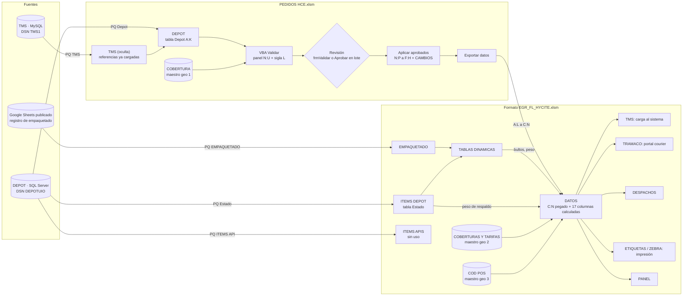

# Análisis del flujo actual: PEDIDOS HCE + Formato EGR_FL_HYCITE

**Alcance.** Revisión completa de los dos libros recibidos, `PEDIDOS HCE.xlsm` y `Formato EGR_FL_HYCITE.xlsm`: hojas, tablas,
fórmulas, nombres definidos, consultas Power Query/ODBC, tablas dinámicas, vínculos externos y todo el código VBA. Se
incluye el formulario `frmValidar`, que no estaba en el código pegado en el chat. También se revisa el flujo de trabajo
entre ambos libros.

**Datos usados como evidencia.** Los libros traen el proceso del **24/09/2026 (135 pedidos HYCITE)**. Cada hallazgo
marcado con cifras se comprobó sobre esos datos. No se modificó ningún archivo.

**Código fuente extraído** (VBA, Power Query, SQL legible e inventario de fórmulas por hoja): [`fuentes_originales/`](../fuentes_originales/).

---

## Contenido

1. [Resumen ejecutivo](#1-resumen-ejecutivo)
2. [Flujo de trabajo actual](#2-flujo-de-trabajo-actual)
3. [PEDIDOS HCE.xlsm: inventario](#3-pedidos-hcexlsm-inventario)
4. [Formato EGR_FL_HYCITE.xlsm: inventario](#4-formato-egr_fl_hycitexlsm-inventario)
5. [Conexiones entre los dos libros](#5-conexiones-entre-los-dos-libros)
6. [Hallazgos](#6-hallazgos)
7. [Puntos a decidir antes de construir el archivo único](#7-puntos-a-decidir-antes-de-construir-el-archivo-único)
8. [Propuesta preliminar de estructura del archivo único](#8-propuesta-preliminar-de-estructura-del-archivo-único)

---

## 1. Resumen ejecutivo

Hoy el proceso de egresos HYCITE se reparte en dos libros que **no comparten maestros ni reglas**:

- **PEDIDOS HCE** descarga de DEPOT los pedidos de las últimas 24 h. Con VBA valida la dirección contra su propia tabla de
  cobertura, propone correcciones y, tras la revisión del operario, exporta los datos al segundo libro.
- **Formato EGR_FL_HYCITE** vuelve a validar la cobertura con **otra** tabla. Cruza el picking (DEPOT) y el empaquetado
  (Google Sheets) para obtener bultos y peso, y arma las cargas para TMS y TRAMACO, el reporte de despachos y las etiquetas.

Conclusiones principales:

1. **Peso, unidades y valor duplicados en pedidos con más de una caja.** La consulta SQL `Estado` repite cada línea de
   producto una vez por cada contenedora del pedido. El 24/09 afectó a **9 pedidos**, con estos excesos:
   - **+193,67 kg** en el peso enviado a TMS, a TRAMACO y a las etiquetas;
   - **+68 unidades** y **+USD 4.206,15** de valor en DESPACHOS.
2. **Tres maestros geográficos distintos:** COBERTURA en PEDIDOS; COBERTURAS Y TARIFAS y COD POS en EGR. No coinciden:
   - 41 combinaciones provincia‑cantón‑parroquia difieren entre ellos;
   - el courier es distinto en 326 destinos;
   - COD POS escribe CAÑAR y RUMIÑAHUI con Ñ, así que **85 destinos nunca obtienen el código de localidad TMS**, entre
     ellos toda la provincia de Cañar.

   Un pedido validado OK en PEDIDOS llegó como VALIDAR a EGR y generó una fila incompleta en la carga TMS.
3. **La validación cambia datos que estaban bien y luego da por buenos sus propios errores.**
   - Cuando una parroquia existe en dos cantones de la misma provincia, el sistema elige el primer cantón y lo marca OK
     sin revisión. El 24/09 pasó 3 veces: TULCAN→MONTUFAR, MANTA→CHONE e IBARRA→COTACACHI. En los tres casos, el sufijo
     del cliente, (TUL), (MAN) o (IBA), confirmaba su cantón.
   - El botón "Aprobar" acepta en lote la sugerencia por parecido de texto, sin un mínimo de parecido. Así pasaron
     PUNZARA→QUINARA y CHAUPICRUZ→RUMIPAMBA.
   - "Aplicar aprobados" sobrescribe los datos originales, y una nueva validación los da por OK.
4. **No hay control de calidad entre etapas.**
   - La exportación envía todas las filas visibles sin mirar su estado.
   - En EGR se corrige DATOS a mano: 9 filas difieren de lo exportado.
   - Los pedidos sin empaquetar salen con 1 bulto por defecto.
   - El valor declarado al TMS es siempre 4,70, porque la tabla TARIFAS está vacía.
5. **No existe validación de picking.** La consulta `ITEMS API` (unidades solicitadas) no alimenta ninguna fórmula, y nada
   compara lo solicitado con lo pickeado. El 24/09, el pedido 102345691 pidió 28 unidades, se confirmaron 27 y nada lo
   marcó.
6. **Hay piezas rotas u obsoletas:**
   - 3 macros que fallan: `RevisarSugerencias`, `FiltrarPorFecha` y `TABLA_APIS`;
   - fórmulas con `#REF!` en EMPAQUETADO!F y en COD POS (2.606 fórmulas);
   - 2 vínculos externos a archivos en carpetas personales;
   - 6 nombres definidos sin uso y 4 rotos;
   - una hoja obsoleta, 6 módulos VBA y un formulario vacíos.

**Antes de construir el archivo único** hay que cerrar las decisiones de la [sección 7](#7-puntos-a-decidir-antes-de-construir-el-archivo-único).
Las que definen el diseño son el maestro geográfico, el código de localidad para TMS, la regla de courier, la ventana de
fechas y el control de calidad antes de exportar.

---

## 2. Flujo de trabajo actual

### 2.1 Diagrama



### 2.2 Paso a paso

| # | Libro › hoja | Acción del operario | Qué ocurre técnicamente | Observaciones |
|---|---|---|---|---|
| 1 | PEDIDOS | Abrir el libro | `Workbook_Open` → `CrearMenuHycite` crea la barra "Validacion HYCITE" (pestaña Complementos) con 9 botones | La barra es de toda la aplicación y no se elimina al cerrar el libro |
| 2 | PEDIDOS › DEPOT | Datos › Actualizar todo | Consulta `Depot` (ODBC `DEPOTUIO`) llena la tabla `Depot` A:K; consulta `TMS` (ODBC `TMS1`) llena la hoja oculta TMS | Ventana de `Depot`: **últimas 24 h móviles**, no el día calendario (H‑20) |
| 3 | DEPOT | Limpiar validación | Borra L (sigla) y N:U (panel) | |
| 4 | DEPOT | Filtrar día | Busca una columna "FECHA" en la fila 1 | **No existe** esa columna: la macro siempre termina con aviso (H‑12) |
| 5 | DEPOT | Validar | `ValidarPedidos` cruza la dirección (B) y la provincia/cantón/parroquia del cliente (F/G/H) con COBERTURA. Escribe en N:U la propuesta, el estado, la evidencia, las sugerencias, la acción y las alertas, y en L la sigla | Algoritmo en §3.6 |
| 6 | DEPOT | Validar línea a línea / Aprobar | `frmValidar` recorre las filas REVISAR y APROBADO. `AprobarTodas` aprueba **en lote** todas las REVISAR con la primera sugerencia | 17 aprobaciones en lote el 24/09 |
| 7 | DEPOT › CAMBIOS | Aplicar aprobados | `AplicarAprobados` copia N:P a F:H en las filas OK y APROBADO y reescribe la hoja CAMBIOS | **Borra el log anterior** y sobrescribe los datos del cliente |
| 8 | DEPOT | Actualizar Parroquia_siglas (opcional) | `ActualizarSiglas` recalcula L desde F/G/H | |
| 9 | PEDIDOS → EGR | Exportar datos (con EGR abierto) | `ExportarADatos` copia A:L de las filas visibles a `DATOS!C:N` | **No filtra por ESTADO** (H‑4) |
| 10 | EGR › EMPAQUETADO | Botón ACTUALIZAR | `ActualizarTodo` refresca EMPAQUETADO (Google Sheets), Estado e ITEMS API (ODBC) y las 5 tablas dinámicas | Sin manejo de errores |
| 11 | EGR › DATOS | Revisar filas REVISAR | Fórmulas: cobertura por clave exacta; bultos y peso desde TABLAS DINAMICAS; courier; código TMS | Se corrige a mano (9 filas el 24/09) |
| 12 | EGR › TMS (oculta) | Copiar y subir al TMS | 42 columnas por fórmula, filas 2 a 255 | **Máximo 254 pedidos** |
| 13 | EGR › TRAMACO (oculta) | Copiar y subir al portal | Solo pedidos con DESTINO = PRO | |
| 14 | EGR › DESPACHOS (oculta) | Reporte | Unidades, ítems, valor, box density, transporte | |
| 15 | EGR › ETIQUETAS ZEBRA | Imprimir | Una fila por bulto; plantilla P3:U15 controlada por Q1 | Impresión **manual etiqueta por etiqueta** (144 el 24/09) |

### 2.3 Qué hace realmente cada pieza (aclaraciones importantes)

- **`CP_DEST` no es un código postal.** La columna DEPOT!H, que pasa a DATOS!J, contiene la **parroquia** (campo
  `CUSTOMS_3`). El comentario de la celda H1 lo confirma. El código postal solo viene dentro del texto de la dirección
  (B), al final: `… CANTÓN PARROQUIA CP PROVINCIA`.
- **Ninguna fórmula de EGR usa la sigla que calcula PEDIDOS.** Esa sigla va de DEPOT!L a DATOS!N `LOCALIDAD_DEST_SIG`.
  El valor que llega al TMS como `CP_DEST` sale de DATOS!AB, una búsqueda en COD POS. Son dos catálogos distintos: solo
  coinciden en 320 de 1.216 destinos comparables. Por tanto, las cerca de 100 líneas de VBA de la sigla (`SiglaFinal`,
  `ActualizarSiglas`, `mSiglas`, `mCodeCant`) producen un dato que hoy nadie consume.
- **La "validación de ítems pickeados" no está implementada.** EGR solo suma lo confirmado en picking (tabla `Estado`) para
  unidades, peso y valor. La hoja ITEMS APIS, con lo solicitado, no la usa ninguna fórmula.
- **La cobertura se valida dos veces, con tablas distintas**: el VBA usa `COBERTURA` (PEDIDOS) y las fórmulas usan
  `COBERTURAS Y TARIFAS!AA` (EGR).
- **Campos del origen reutilizados** (consulta `Depot`):

  | Campo de origen | Significado real |
  |---|---|
  | `CUSTOMS_1` | dirección |
  | `CUSTOMS_2` | cantón |
  | `CUSTOMS_3` | parroquia |
  | `info_adicional_3` | destinatario |
  | `info_adicional_6` | provincia |
  | `info_adicional_5` / `info_adicional_4` | teléfono móvil / fijo |
  | `NRO_DESPACHO_IMPORTACION` | email |

  La **parroquia llega truncada a 25 caracteres**, por ejemplo `QUITO DISTRITO METROPOLIT` o `PUERTO FRANCISCO DE ORELL`.

---

## 3. PEDIDOS HCE.xlsm: inventario

### 3.1 Hojas

| Hoja | Estado | Rango | Contenido | Fórmulas |
|---|---|---|---|---|
| COBERTURA | visible | A1:Q1303 | Tabla `Tabla45`, **maestro geográfico 1** (1.302 filas). Columnas: Provincia, CantOn, Parroquia, PARROQUIA_SIGLAS, ZONA, TIPO DE TRAYECTO, DIAS, L…D, DIAS FRECUENCIA, TIEMPO, GESTOR DE ENTREGAS. Tiene un filtro activo (CANAR / LA TRONCAL) que oculta 1.299 filas | 0 |
| DEPOT | visible | A1:V136 | Tabla de consulta `Depot` (A:N) más el panel de validación N:U. De O en adelante, el panel queda **fuera** de la tabla | 135 |
| CAMBIOS | visible | A1:K63 | Log de la **última** ejecución de "Aplicar aprobados" | 0 |
| TMS | oculta | A1:B986 | Tabla de consulta `TMS`: referencias cargadas en el TMS (7 días) | 0 |
| Claude Log | oculta | A1:F9 | Bitácora de sesiones anteriores de asistencia | 0 |

### 3.2 Conexiones y consultas

| Conexión | Origen | Carga en | Qué trae | Filtro de fecha |
|---|---|---|---|---|
| Consulta - Depot | ODBC `dsn=DEPOTUIO` (SQL Server) | tabla `Depot` | Pedidos tipo `E04` del cliente `HYCITE2` (excluye `agente_id = 'HYCITE2'`) | `syd_ad.fecha_creacion >= DATEADD(day,-1,GETDATE())` = últimas 24 h. El comentario del SQL dice "hace 7 días" |
| Consulta - TMS | ODBC `dsn=TMS1` (sintaxis MySQL) | tabla `TMS` | `idreferencia`, `fecha_interfaz` de `pedido` con `idempresa = '1'` | últimos 7 días |

Detalles del SQL de `Depot` ([`sql/Depot.sql`](../fuentes_originales/PEDIDOS_HCE/sql/Depot.sql)):

- `REPLACE('0' + info_adicional_5, '-', '')` antepone un 0 **siempre**. Cuando el número ya lo trae, queda "00…":
  pasa en 16 pedidos (22 números de teléfono fijo).
- `NRO_REFERENCIA_VIAJE` es la misma columna que `NRO_REFERENCIA` (`doc_ext`).
- **No tiene `ORDER BY`.** El orden de las filas puede cambiar entre actualizaciones, y las columnas manuales (L, N y el
  panel O:U) no se mueven con ellas (H‑21).

### 3.3 Tablas, nombres y vínculos

- **`Depot`** (A1:N136) es una tabla de consulta con 3 columnas **no enlazadas** a la consulta: L `Parroquia_Siglas`,
  M `ESTAD EN TMS` y N `PROVINCIA_PROP`. Tiene guardado un **orden por color de la columna L**, que reordena A:N pero no O:U.
- **Nombres `DATA_CAJAS` y `DATA_CODIGOS`.** Apuntan al libro externo `Formato EGR_FL_HYCITE - copia.xlsm`, en la carpeta
  Descargas de un usuario. Ninguna fórmula ni el VBA los usa. Solo provocan el aviso de "actualizar vínculos" y guardan
  242 KB de caché.
- **DEPOT tiene restos de un diseño anterior:**
  - un filtro de hoja en O1:V99, más corto que los datos (que llegan a la fila 136);
  - reglas de formato OK/REVISAR/APROBADO repetidas en Q2:Q136 (vigentes) y en R2:R99 (restos);
  - el encabezado `ALERTAS/DUPLICADOS` duplicado en V1.

### 3.4 Fórmulas

Solo hay una, la columna calculada `ESTAD EN TMS` (M):

```
=IF(VLOOKUP([@NRO_REFERENCIA],TMS[idreferencia],1,0)=[@NRO_REFERENCIA],"Cargado en TMS","Pendiente Cargar TMS")
```

Si la referencia no está en TMS, la fórmula devuelve `#N/A`. El texto **"Pendiente Cargar TMS" nunca aparece** (H‑13).
El 24/09 las 135 filas decían "Cargado en TMS".

### 3.5 VBA: estructura, constantes y variables

| Componente | Contenido |
|---|---|
| `ThisWorkbook` | `Workbook_Open` → `CrearMenuHycite` |
| `Módulo1` | 813 líneas, 32 procedimientos, `Option Explicit` ([`Modulo1.bas`](../fuentes_originales/PEDIDOS_HCE/vba/Modulo1.bas)) |
| `frmValidar` | 124 líneas; formulario cuyos controles se crean al abrirlo ([`frmValidar.frm`](../fuentes_originales/PEDIDOS_HCE/vba/frmValidar.frm)) |
| Módulos de hoja | vacíos |

**Constantes**

| Constante | Valor | Significado |
|---|---|---|
| `HD` | `"DEPOT"` | hoja de pedidos |
| `H1` | `"COBERTURA"` | hoja maestro |
| `C_DIR` | 2 (B) | dirección |
| `C_REF` | 3 (C) | número de referencia; define la última fila |
| `C_PROV`, `C_CANT`, `C_PARR` | 6, 7, 8 (F, G, H) | provincia, cantón y parroquia del cliente |
| `C_NN` | 14 (N) | primera columna del panel N:U |
| `SOLO_FILTRADO` | `True` | procesa solo las filas visibles |

`frmValidar` **repite** `C_NN`, `C_REF` y `C_DIR`, y añade `C_SIG = 12` (L). Si el diseño cambia, hay que corregirlo en
dos lugares.

**Variables de módulo.** Son 13 diccionarios que carga `CargarBases`/`AddBase` desde `COBERTURA!A:D`:

| Variable | Clave → valor | Para qué se usa |
|---|---|---|
| `mPC` | provincia → código de 2 dígitos (24 provincias, lista fija en `Mapa`) | votación, CP |
| `mRev` | código → provincia | CP → provincia |
| `mProvParr` | provincia → `\|PARR1\|PARR2\|…` | ¿la parroquia existe en la provincia? |
| `mParrList` | provincia → colección (parroquia normalizada, cantón, parroquia original) | parser de cola, sugerencias |
| `mCantonProv` | cantón (≥ 4 letras) → provincia + cantón | votación. **Gana el primero**: un cantón con el mismo nombre en 2 provincias queda solo en una |
| `mCantonProvM` | cantón → lista de provincias | se llena pero **no se usa** |
| `mParrGlobal` | parroquia → todas sus ubicaciones | alerta de duplicados |
| `mPcSet` | provincia\|parroquia → cantones posibles | `ResolveCanton` |
| `mCantonParr` | provincia\|cantón → parroquias | lista de candidatas para las sugerencias |
| `mParrOrig` | provincia\|parroquia → texto original | salida P |
| `mTriple` | provincia\|cantón\|parroquia → cantón | validación de la tríada |
| `mSiglas` | tríada, y también provincia\|\|parroquia → sigla (gana la primera) | `SiglaFinal` |
| `mCodeCant` | provincia\|cantón → código tomado de la sigla (ej. `QUI`); gana el primero | sigla generada |

**Procedimientos**

| Procedimiento | Botón | Qué hace | Observaciones |
|---|---|---|---|
| `CrearMenuHycite`, `AddBtn` | al abrir | Crea la barra con 9 botones | El orden no sigue el flujo diario |
| `ValidarPedidos` | Validar | Algoritmo de §3.6; escribe N:U y L | Ver H‑3, H‑9 |
| `AprobarTodas` | Aprobar | REVISAR → APROBADO para **todas** las filas visibles | Sin revisión fila a fila (H‑10) |
| `AplicarAprobados` | Aplicar aprobados | Copia N:P a F:H (OK y APROBADO) y registra en CAMBIOS | `lg.Cells.Clear` borra el historial; F:H son columnas de la consulta y se pierden al actualizar (H‑21) |
| `ActualizarSiglas` | Actualizar Parroquia_siglas | Recalcula L desde F/G/H | Sin manejo de errores |
| `ExportarADatos` | Exportar datos | Copia A:L de las filas visibles a `DATOS!C:N` del libro abierto cuyo nombre contiene "EGR" y "HYCITE" | No filtra por estado; puede escribir en una copia; convierte teléfonos en números (H‑4, H‑17, H‑22) |
| `Desbloquear` | Desbloquear | Restaura pantalla, eventos, cálculo y área de desplazamiento | |
| `FiltrarPorFecha` | Filtrar día | Borra las filas de otras fechas | **No funciona**: DEPOT no tiene columna FECHA (H‑12) |
| `AbrirValidador` | Validar línea a línea | `frmValidar.Show vbModeless` | |
| `LimpiarValidacion` | Limpiar validación | Borra L y N:U | El mensaje dice que A:K no se toca, pero "Aplicar" sí modifica F:H |
| `RevisarCambios` | sin botón | Revisa las filas APROBADO: provincia válida y parroquia dentro de la provincia | No valida el cantón |
| `RevisarSugerencias` | sin botón | `frmRevisar.Show` | **`frmRevisar` no existe** (H‑11) |
| `CargarBases`, `AddBase` | | Cargan los diccionarios | |
| `Normaliza` | | Mayúsculas, sin tildes, Ñ→N, quita paréntesis y signos, guion → espacio, arreglo de caracteres mal codificados | Ver H‑18 |
| `Pretty` | | CANAR → CAÑAR | Ver H‑5 |
| `Lev` | | Distancia de Levenshtein (parecido entre dos textos) | Usa `Application.Min` en el bucle interno: lento |
| `FuzzyStr`, `FirstFuzzy` | | Las 3 parroquias más parecidas / la más parecida | **Sin mínimo de parecido**; calculan dos veces lo mismo |
| `ResolveCanton` | | Elige el cantón de una parroquia | Si hay varios, toma el primero |
| `ProvDeCP`, `FindCP`, `ProvFromCP` | | CP de 6 dígitos → provincia | Usa 2 de los 6 dígitos |
| `ParseColaDireccion` | | Lee la cola `… PARROQUIA CP PROVINCIA` | No lee el cantón |
| `SiglaFinal`, `CodigoSig` | | Sigla de la parroquia | Su resultado no se usa en EGR |
| `FormatoPanel`, `ColorearCambios`, `MarcaDif` | | Encabezados, formato condicional; pinta de amarillo N:P si difiere de F:H | |
| `TX` | | Valor de la celda como texto (errores → "") | |

### 3.6 Algoritmo de `ValidarPedidos`

1. Normaliza F, G, H y la dirección B.
2. **Parser de la cola de la dirección (prioritario).**
   - Toma el último número de 6 dígitos de B como código postal.
   - Provincias candidatas: la del CP (sus 2 primeros dígitos) y las escritas después del CP.
   - Busca la parroquia más larga del maestro con la que termina el texto anterior al CP.
   - Si la encuentra, la provincia y la parroquia salen de la dirección y el cantón se deduce con `ResolveCanton`. El
     estado es OK si la parroquia existe en la provincia.
   - **No compara con el cantón del cliente (G) ni con el sufijo entre paréntesis**: la normalización lo elimina.
3. **Si no hay cola: votación de provincia.** Suman votos:

   | Evidencia | Votos |
   |---|---|
   | provincia del cliente (F) | +1 |
   | cantón del cliente (G) | +1 |
   | provincia escrita en la dirección | +3 |
   | cantón escrito en la dirección | +2 |
   | CP | +2 |

   En empate gana F. Sin votos, la provincia queda en **PICHINCHA**.
4. **Parroquia.**
   - Si H existe en la provincia → OK.
   - Si no, busca en la dirección una parroquia del cantón o de la provincia → estado DIR.
   - Si tampoco, sugiere por parecido de texto → SUGERIR u OTRA_PROV.
5. **Regla de Quito.** Si la provincia es PICHINCHA, el estado no es OK y la dirección dice QUITO o DMQ, el cantón queda en
   QUITO y la parroquia en "DISTRITO METROPOLITANO DE QUITO" (estado QUITO).
6. **ESTADO.** Queda en OK solo si se cumplen todas estas condiciones:
   - la parroquia quedó en estado OK y la provincia es válida;
   - F coincide con la provincia propuesta (esta condición no se exige cuando se usó el parser de cola);
   - no hay un duplicado sin confirmar (tampoco se exige con el parser de cola).

   Si falla alguna, queda en REVISAR con una acción sugerida: Confirmar parroquia, Parroquia de otra provincia, Elegir
   parroquia sugerida, Parroquia de la dirección, Confirmar Quito/DMQ o Verificar duplicado.
7. **Sigla en L** (`SiglaFinal`):
   - Quito sin parroquia → `CALDERON (QUI)`.
   - Tríada que no está en el maestro → `Fuera de cobertura (Sug: …)`.
   - En otro caso, la sigla del maestro, o el nombre + el código del cantón.

Resultado del 24/09: **130 OK y 5 REVISAR** (todos "Confirmar Quito/DMQ").

### 3.7 `frmValidar`

- Carga las filas visibles en REVISAR o APROBADO. Muestra el pedido, la dirección y tres listas:
  - provincia: lista fija de 24, escrita con "CAÑAR";
  - cantón: **solo** el actual y el nombre de la parroquia;
  - parroquia: la actual más las sugerencias, a las que se les quita el cantón.
- "Aplicar y siguiente" escribe N:P, pone APROBADO, deja un texto en T y recalcula L. **No valida** que la tríada exista y
  **no ajusta el cantón** cuando se elige una sugerencia de otro cantón.
- Es **no modal**. La lista de filas se toma al abrir el formulario; si se ordena o filtra la hoja con el formulario
  abierto, las filas dejan de corresponder.
- Los cambios que la hoja `Claude Log` registra como entregados en una sesión anterior (turno 7: función `Candidatos`,
  estado `ELEGIR`, lista con `[CANTON]`) **no están en el código actual**.

---

## 4. Formato EGR_FL_HYCITE.xlsm: inventario

### 4.1 Hojas

17 hojas (10 visibles y 7 ocultas) con **64.055 fórmulas**. De ellas, 13.298 son de matriz dinámica, que solo funcionan
en Excel 365 o 2021.

| Hoja | Estado | Rol | Fórmulas | Lee de | Alimenta a |
|---|---|---|---|---|---|
| Claude Log | visible | Bitácora; 3 fórmulas de prueba (XLOOKUP, FILTER, TEXTJOIN) en H1:H3 | 3 | — | — |
| PANEL | visible | 9 indicadores y los 5 pasos de producción | 9 | DATOS | — |
| MENU | oculta | 9 formas con hipervínculos; 3 apuntan a hojas que no existen | 0 | — | — |
| **DATOS** | visible | Hoja central: 12 columnas pegadas desde PEDIDOS (C:N) y 17 calculadas | 7.984 | PEDIDOS, COBERTURAS, COD POS, TABLAS DINAMICAS, Estado, TARIFAS | TMS, TRAMACO, DESPACHOS, ETIQUETAS, ZEBRA, PANEL |
| TMS | oculta | Carga al TMS (42 columnas, filas 2 a 255) | 6.858 | DATOS | copiar y pegar |
| TRAMACO | oculta | Carga al portal de TRAMACO (solo PRO) | 8.000 | DATOS | copiar y pegar |
| DESPACHOS | oculta | Reporte de despachos | 8.000 | DATOS, TABLAS DINAMICAS | — |
| ETIQUETAS | visible | Lista antigua de etiquetas (nombre y apellido partidos) | 5.500 | DATOS | impresión |
| ETIQUETAS ZEBRA | visible | Una fila por bulto y plantilla P3:U15 (Q1 = número de etiqueta) | 10.396 | DATOS | impresión |
| COBERTURAS Y TARIFAS | visible | **Maestro geográfico 2** (1.303 filas), claves X:AA y tabla TARIFAS AC:AF (vacía) | 1.303 | — | DATOS |
| ITEMS APIS | visible | Tabla `ITEMS_API` (consulta) y una tabla dinámica | 1.160 | DATA_CODIGOS | **nada** |
| ITEMS DEPOT | visible | Tabla `Estado` (consulta de picking) con peso, volumen y precio | 5.160 | DATA_CODIGOS | TABLAS DINAMICAS, DATOS!S, EMPAQUETADO!F |
| EMPAQUETADO | visible | Tabla `EMPAQUETADO` (Google Sheets) con 6 columnas calculadas; botón ACTUALIZAR | 696 | Estado, DATA_CAJAS, TABLAS DINAMICAS | TABLAS DINAMICAS |
| TABLAS DINAMICAS | visible | 4 tablas dinámicas y la columna K | 545 | Estado, EMPAQUETADO | DATOS, DESPACHOS, EMPAQUETADO |
| Temp_Tramaco | oculta | Vacía, marcada como obsoleta | 0 | — | — |
| COD POS | oculta | **Maestro geográfico 3**: nombre de parroquia para el TMS. I:J con vínculo externo roto | 7.818 | vínculo externo | DATOS!AB |
| DATA CODIGO Y CAJAS | oculta | Maestro de productos (B:M) y de cajas (O:Z) | 623 | — | ITEMS APIS, ITEMS DEPOT, EMPAQUETADO |

### 4.2 Conexiones y consultas

| Conexión | Tipo | Origen | Carga en | Filtro |
|---|---|---|---|---|
| Consulta - EMPAQUETADO | Power Query → modelo de datos | CSV de una hoja de Google Sheets **publicada en la web** | tabla `EMPAQUETADO`, vía `ModelConnection_DatosExternos_6` | `Date.IsInCurrentDay([FECHA])` (usa la fecha del PC) y # ORDEN no vacío |
| Consulta - Estado | Power Query / ODBC `DEPOTUIO` | picking, contenedoras (`VIEW_TIEMPO_EMPAQUETADO`) y status | tabla `Estado` (ITEMS DEPOT) | desde ayer a las 00:00 |
| Consulta - ITEMS API | Power Query / ODBC `DEPOTUIO` | `SYS_INT_DET_DOCUMENTO`: líneas solicitadas | tabla `ITEMS_API` | solo hoy |
| ModelConnection_DatosExternos_6, ThisWorkbookDataModel | modelo de datos | — | — | — |

Código: [`powerquery/Section1.m`](../fuentes_originales/Formato_EGR_FL_HYCITE/powerquery/Section1.m),
[`sql/Estado.sql`](../fuentes_originales/Formato_EGR_FL_HYCITE/sql/Estado.sql) y
[`sql/ITEMS_API.sql`](../fuentes_originales/Formato_EGR_FL_HYCITE/sql/ITEMS_API.sql). La URL publicada de Google Sheets
se ocultó en la copia del repositorio.

### 4.3 Tablas dinámicas

| Nombre | Hoja / ubicación | Origen | Filas | Valores | La usa |
|---|---|---|---|---|---|
| TablaDinámica2 | TABLAS DINAMICAS B3:F261 | `'ITEMS DEPOT'!A1:K1291` (**rango fijo**) | PEDIDO | Σ Cantidad confirmada ("CANTIDAD PICKEADA"), Σ PESO, Σ PRECIO, Cuenta de CODIGO | DESPACHOS J/K/N, TABLAS DINAMICAS!K |
| TablaDinámica1 | TABLAS DINAMICAS H3:J112 | `EMPAQUETADO!C:I` (columnas completas) | # ORDEN | Σ BULTOS, Σ PESO CAJA | DATOS R y S (vía H:K) |
| TablaDinámica7 | TABLAS DINAMICAS M3:N252 | la misma caché que TablaDinámica2 | NRO_CONTENEDORA_EMPAQUE | Σ VOLUMEN | EMPAQUETADO!J |
| TablaDinámica4 | TABLAS DINAMICAS P3:Q112 | `EMPAQUETADO!C:K` | # ORDEN | Promedio de PORCENTAJE | DESPACHOS!O |
| TablaDinámica1 | ITEMS APIS M1:N137 | tabla `ITEMS_API` | PEDIDOS | Σ PESO | nada |

El nombre "TablaDinámica1" existe en dos hojas.

### 4.4 Nombres definidos

| Situación | Nombres |
|---|---|
| **Usados** | `COBERT_KEY` (AA2:AA1804); `TARIFAS` (AC1:AF10, **vacía**); `RUTA_COB` (V2:V1804, **vacía**); `DATA_CODIGOS` (B:M); `DATA_CAJAS` (O:Z) |
| **Sin uso** | `COD_POSTAL`, `PROVINCIA`, `CIUDAD`, `CIUDAD_PARROQ`, `CIUDAD_RUTA`, `RUTAS` |
| **Rotos (`#REF!`), con ámbito de hoja** | `CIUDAD`, `PROV_CIUD` y `TARIFAS` (COBERTURAS Y TARIFAS); `EGRESOS_CORRCAL` (MENU) |

### 4.5 Hoja DATOS, columna por columna

| Col | Encabezado | Origen o fórmula (resumen) | Nota |
|---|---|---|---|
| A | DESTINO | Según la provincia (O): PICHINCHA = UIO, GUAYAS = GYE, GALAPAGOS = GPS, otra = PRO; si O es VALIDAR, vacío | Decide TRAMACO o FLEXNET |
| B | PEDIDOS | `VALUE(E)` | |
| C–N | *(pegado)* | `ExportarADatos` | Ver §5.1 |
| O / P / Q | PROVINCIA / CANTON / PARROQUIA | `INDEX(COBERTURAS X/Y/Z; MATCH(TEXTJOIN("_";H;I;J); COBERT_KEY))`, o "VALIDAR" | Coincidencia **exacta** del texto |
| R | BULTOS | Σ BULTOS de TABLAS DINAMICAS H:K; si el pedido no está → **1** | H‑7 |
| S | PESOS | TABLAS DINAMICAS!K (peso de ítems + cajas); si no está → Σ `Estado[PESO]`; si tampoco → "-" | H‑1 |
| T | VALOR | Tarifa por provincia: base + adicional × (kg − 10) | TARIFAS vacía → 0 (H‑8) |
| U | GUIAS | se llena a mano | |
| V | VALIDACION | REVISAR si O, P o Q dicen VALIDAR | |
| W | RUTA | `RUTA_COB` | Su origen está vacío |
| X | ACUM_BULTOS | Acumulado de R | Base de ETIQUETAS ZEBRA |
| Y | COURIER | `COBERTURAS!E` (Gestor de Entregas) | |
| Z | PARR SIN () | Parroquia sin el sufijo | |
| AA | CONCA | O & P & Z | |
| AB | PARR TMS | `VLOOKUP(AA; 'COD POS'!D:E; 2)` | Va a TMS!N (CP_DEST) |
| AC | N_PRO | Contador de pedidos PRO | Número de fila en TRAMACO |

### 4.6 Hojas de salida

- **TMS (A2:AP255)**
  - Remitente fijo: HYCITE / HYCITE QUITO / dirección de FLEX NET en Llano Grande; `CP_RTTE` "CALDERON (QUI)";
    QUITO / PICHINCHA.
  - Del pedido: DESTINATARIO = DATOS!G; DIRECCION_DEST = DATOS!D; **CP_DEST = DATOS!AB**; LOCALIDAD = DATOS!P;
    PROVINCIA = DATOS!O; NRO_REFERENCIA y NRO_FACTURA = DATOS!B.
  - **VALOR TOTAL FACTURA** = DATOS!T, o **4,7** cuando es 0.
  - Teléfonos con un "0" antepuesto; un email genérico por defecto.
  - Fechas y fijos: FECHA_INTERFAZ = `HOY()`; FECHA_COMPRA = `HOY()+1`; CANTIDAD = bultos; PESO_KG = DATOS!S;
    OPERACION DESPACHO; TIPO_SERVICIO NORMAL.
  - Las columnas del remitente, las fechas y las fijas dependen de DATOS!A. En cambio, dirección, CP, localidad, provincia,
    referencia, valor, teléfonos, bultos y peso toman sus datos directamente de DATOS. Por eso un pedido VALIDAR genera una
    **fila parcial** (H‑2).
- **TRAMACO (A2:AG501)**
  - AG = fila del n‑ésimo pedido PRO.
  - Del pedido: C = destinatario; F/G/H = provincia, cantón y parroquia; I = dirección; N = teléfono (**sin 0**);
    R = peso; W = bultos; AD = pedido.
  - Fijos: D, J, K y L = "."; Q = "CARGA LIVIANA"; AB = "TAPAS Y OLLAS".
  - M (código postal) queda vacío. Error en el encabezado: "LACALIDAD".
- **DESPACHOS (A2:Q501)**
  - Fecha = `HOY()`; pedido; cliente; teléfono (sin 0); E "Cod. Postal" vacío; dirección; provincia, cantón y parroquia.
  - Unidades, ítems y valor salen de TABLAS DINAMICAS B:F; bultos; peso; box density (P:Q).
  - Transporte: PRO → TRAMACO, resto → FLEXNET; guía = DATOS!U.
- **ETIQUETAS**: pedido; nombres y apellidos partidos por espacios; destino; ruta (la rama "ALEXIS" nunca se cumple);
  status (lista "-,OK").
- **ETIQUETAS ZEBRA**
  - A = número global del bulto; N = fila de DATOS; I/J = "bulto i de n".
  - Plantilla P3:U15: courier, pedido, "BULTO i DE n", destinatario, dirección, parroquia‑cantón‑provincia, teléfono y
    peso.
  - Q1 elige la etiqueta que se imprime.
- **PANEL**: pedidos, bultos, con peso, sin peso, REVISAR, sin courier, PRO, UIO y GYE.
  Valores del 24/09: 135 / 144 / 135 / 0 / 1 / 1 / 58 / 42 / 34.

### 4.7 Hojas de soporte

- **EMPAQUETADO** (tabla B1:K117)
  - De Google Sheets: FECHA, # ORDEN, TIIPO CAJA, # CONTENEDORA.
  - Calculadas:
    - **NRO. DE CONTENEDORA**: E, o un XLOOKUP a `Estado`. El argumento "si no se encuentra" contiene `COUNTIF(#REF!…)`.
    - **BULTOS** = 1; **PESO CAJA** = peso en DATA_CAJAS + 0,1; **VOL. CAJA**.
    - **VOL. ITEMS** = Σ VOLUMEN de la contenedora en TABLAS DINAMICAS M:N, o del pedido.
    - **PORCENTAJE** (box density) entre 30 % y 100 %; fijo en 100 % para F1, F5, F10, F11 y SOBRE 1.
- **ITEMS DEPOT** (tabla `Estado`): añade PEDIDO; PESO = peso unitario × confirmada; VOLUMEN (en cm³); PRECIO = costo
  unitario × confirmada, o "Verificar". El 24/09 hubo 2 líneas del producto LT0044 sin maestro.
- **ITEMS APIS** (tabla `ITEMS_API`): añade PEDIDOS y PESO.
- **TABLAS DINAMICAS!K** = Σ peso de los ítems (B:D) + peso de las cajas (J).
- **COBERTURAS Y TARIFAS**
  - B:D son las columnas visibles; X:Z son las claves que usan las fórmulas, y **difieren de B:D en 22 filas**.
  - W, código postal numérico: pierde el 0 inicial (AZUAY: 11550).
  - V, RUTA: vacía. AC:AF, TARIFAS: vacía; la nota en AC12 menciona DATOS!U, pero VALOR está en T.
  - Tiene un filtro activo en LA TRONCAL.
- **COD POS**
  - A provincia; B cantón, **con Ñ**; C parroquia sin paréntesis; D clave A&B&C.
  - E: el nombre de la parroquia para el TMS, aunque el encabezado dice "CODIGO POSTAL". F: zona.
  - G:J auxiliares; I:J hacen XLOOKUP al libro externo `[1]` y dan `#REF!`.
- **DATA CODIGO Y CAJAS**: productos (la columna "VOL_M3" está en realidad en cm³) y cajas. Tiene 185 reglas de formato
  condicional, 179 de ellas de "valores duplicados" y casi todas sobre la columna B.

### 4.8 VBA y botones

- **Módulo7** ([`Modulo7.bas`](../fuentes_originales/Formato_EGR_FL_HYCITE/vba/Modulo7.bas)):
  - `TABLAS` refresca 4 tablas dinámicas usando `Select`.
  - `TABLA_APIS` refresca "TablaDinámica3" en ITEMS APIS, pero **esa tabla no existe** (se llama TablaDinámica1):
    da el error 1004.
  - `ActualizarTodo` está asignada al botón ACTUALIZAR de EMPAQUETADO.
- Vacíos: Módulo1 a Módulo6, `UserForm1`, `ThisWorkbook` y los módulos de hoja.
- **MENU (oculta)**: formas DATOS, ITEMS, EMPAQUETADO, TRAMACO, GUIAS, DESPACHOS, TRANSPORT, PRUEBA DE PICKIN y REPORTE.
  ITEMS, GUIAS y TRANSPORT apuntan a hojas que no existen; las dos últimas no tienen enlace.
- No hay macro de impresión de etiquetas. La bitácora la registra como pendiente desde el 19/08.

---

## 5. Conexiones entre los dos libros

### 5.1 Mapeo de la exportación DEPOT → DATOS

| DEPOT (PEDIDOS) | Contenido real | → DATOS (EGR) | Encabezado en DATOS | Lo usa después |
|---|---|---|---|---|
| A `EMPRESA` | "HYCITE" | C | CLIENTE | — |
| B `DIRECCION_DEST` | dirección completa, con cantón, parroquia, CP y provincia al final | D | OBSERVACIONES | TMS!K, TRAMACO!I, DESPACHOS!F, ZEBRA |
| C `NRO_REFERENCIA` | número de pedido | E | DOC_EXT | B = `VALUE(E)`, y de ahí todo |
| D `NRO_REFERENCIA_VIAJE` | igual a C | F | CODIGO_VIAJE | — |
| E `DESTINATARIO` | nombre | G | DESTINATARIO | TMS, TRAMACO, DESPACHOS, etiquetas |
| F `PROVINCIA_DEST` | provincia (corregida si se ejecutó "Aplicar") | H | PROVINCIA_DEST | clave de cobertura |
| G `LOCALIDAD_DEST` | cantón | I | LOCALIDAD_DEST | clave de cobertura |
| H `CP_DEST` | **parroquia** | J | CP_DEST | clave de cobertura |
| I `TELEFONO_MOVIL` | móvil | K | TELEFONO_MOVIL | TMS!W, TRAMACO!N, DESPACHOS!D, ZEBRA |
| J `Telefono_FIJO` | fijo | L | Telefono_FIJO | TMS!X |
| K `Email` | email | M | Email | TMS!Y |
| L `Parroquia_Siglas` | sigla calculada por el VBA | N | LOCALIDAD_DEST_SIG | **ninguna fórmula** |
| M, N:U | estado TMS y panel de validación | — | no se exportan | — |

### 5.2 Cadena de cálculo en EGR

1. **Pedido.** `DATOS!C:N` (pegado) → `DATOS!B` → `DATOS!O:Q`, validados contra `COBERT_KEY`.
2. **Destino y códigos.** `DATOS!A`, el destino, sale de la provincia. `DATOS!Y`, el courier, y `DATOS!AB`, el código
   TMS, salen de COBERTURAS Y TARIFAS y de COD POS.
3. **Picking.** `Estado` (picking) → TablaDinámica2 y TablaDinámica7.
4. **Empaquetado.** `EMPAQUETADO` → TablaDinámica1 y TablaDinámica4. `TABLAS DINAMICAS!K` suma el peso de los ítems y el
   de las cajas.
5. **Bultos, peso y valor.** De lo anterior salen `DATOS!R` (bultos), `DATOS!S` (peso) y `DATOS!T` (valor = TARIFAS);
   `DATOS!X` acumula los bultos.
6. **Salidas.** TMS, TRAMACO (vía `DATOS!AC`), DESPACHOS, ETIQUETAS, ETIQUETAS ZEBRA (vía `DATOS!X`) y PANEL.

### 5.3 Los tres maestros geográficos

| | COBERTURA (PEDIDOS) | COBERTURAS Y TARIFAS (EGR) | COD POS (EGR) |
|---|---|---|---|
| Filas | 1.302 | 1.303 (1.301 con clave) | 1.303 |
| La usa | VBA `ValidarPedidos` y `SiglaFinal` | DATOS O:Q, W, Y | DATOS!AB → TMS `CP_DEST` |
| Código de parroquia | PARROQUIA_SIGLAS: "TARQUI (GUA)", "CUENCA (AZ)" | — | E: "TARQUI (GUA)", "CUENCA" |
| Courier | GESTOR DE ENTREGAS | Gestor de Entregas (**distinto en 326 destinos**) | — |
| Uso de la Ñ | no (CANAR, RUMINAHUI) | no | **sí** (CAÑAR, RUMIÑAHUI: 61 filas) |
| Código postal | — | numérico, sin el 0 inicial | — |

Diferencias comprobadas:

- **41 tríadas** están en un maestro y no en el otro, por ejemplo:
  - `GUAYAS / EL EMPALME` frente a `GUAYAS / EMPALME`;
  - `SALITRE (URBINA JADO)` frente a `SALITRE`;
  - `LOS RIOS / QUEVEDO / 24 DE MAYO` solo existe en PEDIDOS;
  - `YANTZAZA` frente a `YANTZAZA (YANZATZA)`.
- La clave X:Z de EGR tiene errores propios. Por ejemplo, la fila 756 dice `BUENA FE / PATRICIA PILAR` en B:D, pero
  `QUEVEDO / PATRICIA PILAR` en la clave.
- La tríada `ESMERALDAS / RIO VERDE / RIO VERDE` está duplicada en ambos maestros.
- `LA CONCORDIA` está en ESMERALDAS, pero su sigla es "LA CONCORDIA (SD)" y la dirección del cliente dice SANTO DOMINGO.
  Hay que confirmar a qué provincia la asigna el courier o el TMS.
- Las siglas de PEDIDOS y los nombres de COD POS **coinciden en 320 de 1.216** destinos comparables.

---

## 6. Hallazgos

Nomenclatura: **H‑n**. 🔴 crítico, porque afecta lo que se envía a TMS, a los couriers o a las etiquetas. 🟠 error de
código o de fórmula. 🟡 riesgo de diseño u operación. ⚪ obsoleto o sin uso.

### 6.1 🔴 Críticos

**H‑1. Peso, unidades y valor duplicados en pedidos con más de una caja (SQL `Estado`).**

*Causa.* `LEFT JOIN VIEW_TIEMPO_EMPAQUETADO VTE ON VTE.PEDIDO = SYD.DOC_EXT` une cada línea de producto con **todas** las
contenedoras del pedido. Como `NRO_CONTENEDORA_EMPAQUE` está en el `SELECT DISTINCT`, las copias no se eliminan.

*Evidencia del 24/09:* 9 pedidos de 2 cajas, todos con el doble.

| Pedido | Peso DATOS/TMS | Peso real | Unidades DESPACHOS | Unidades reales |
|---|---|---|---|---|
| 102333117 | 36,50 | 18,25 | 4 | 2 |
| 102342469 | 49,98 | 26,14 | 24 | 12 |
| 102344769 | 51,94 | 27,42 | 14 | 7 |
| … (6 más) | | | | |
| **Total exceso** | **+193,67 kg** | | **+68 u** | |

El valor en DESPACHOS también se duplica: +USD 4.206,15. El volumen por contenedora (TablaDinámica7) asigna a cada caja el
volumen de todo el pedido, lo que infla la box density.

*Afecta a:* TMS PESO_KG, TRAMACO PESO, la etiqueta "PESO", DESPACHOS (unidades, ítems, valor, box density) y el
PORCENTAJE de EMPAQUETADO.

*Arreglo probable:* tomar la contenedora de la propia línea de picking (`p.nro_ucempaquetado` ya existe en la subconsulta)
en lugar de unir `VTE` por pedido. Debe validarlo quien administra la base.

**H‑2. Tres maestros geográficos incoherentes (§5.3).**

*Impacto del 24/09:*
- El pedido **102344526** (LOS RIOS / QUEVEDO / 24 DE MAYO) quedó OK en PEDIDOS y VALIDAR en EGR. Salió sin DESTINO, sin
  COURIER y con una **fila parcial en la carga TMS**: sin destinatario ni remitente, con "VALIDAR" como provincia y
  localidad, pero con referencia, dirección y valor.
- **5 pedidos sin `CP_DEST`** para el TMS: 102343716, 102344526, 102345094, 102346480 y 102346913. Cuatro se deben a la Ñ
  de COD POS (RUMIÑAHUI, CAÑAR).
- En total, **85 de 1.301 destinos** no pueden obtener nunca el código TMS, entre ellos los 37 de CAÑAR.

**H‑3. La validación cambia cantones correctos y los marca OK.**

*Causa.* Si la parroquia existe en dos cantones de la provincia, `ParseColaDireccion` y `ResolveCanton` toman **el primer
cantón del maestro**. Además, `Normaliza` elimina el sufijo del cliente, (TUL), (MAN) o (IBA), que lo resolvería. Con el
parser de cola, la alerta de duplicado no impide el OK.

*Evidencia (log CAMBIOS del 24/09, todos "Sin acción"):*

| Pedido | Cliente | Resultado aplicado | Indicios de que el cliente tenía razón |
|---|---|---|---|
| 102344423 | CARCHI / TULCAN / GONZALEZ SUAREZ (TUL) | MONTUFAR / GONZALEZ SUAREZ (MON) | CP 040105 y dirección "… TULCAN GONZALEZ SUAREZ (TUL)" |
| 102333126 | MANABI / MANTA / ELOY ALFARO (MAN) | CHONE / ELOY ALFARO (CHO) | sufijo (MAN) |
| 102346914 | IMBABURA / IBARRA / SAN FRANCISCO (IBA) | COTACACHI / SAN FRANCISCO (COT) | sufijo (IBA) |

El paquete sale rotulado y enrutado al cantón equivocado.

**H‑4. No hay control de calidad entre PEDIDOS y EGR, y DATOS se corrige a mano.**

- `ExportarADatos` exporta **todas** las filas visibles, incluidas las REVISAR. El 24/09 salieron 5 en REVISAR.
- Si no se ejecutó "Aplicar aprobados", exporta F:H **originales** junto con la sigla L **corregida**: dos datos
  incoherentes.
- DATOS difiere de DEPOT en **9 filas**, todas corregidas a mano en EGR:
  - 6 × "DISTRITO METROPOLITANO DE QUITO" o "QUITO DISTRITO METROPOLITANO" → "CALDERON (QUI)";
  - 2 × "YANTZAZA" → "YANTZAZA (YANZATZA)";
  - 1 × "CAÑAR" → "CANAR".
- Estas correcciones no quedan registradas en ningún log.

**H‑5. `Pretty` convierte CANAR en CAÑAR y rompe la clave de EGR.** `ValidarPedidos` escribe `Pretty(prov)` en N, y
"Aplicar" la copia a F. Pero EGR y COD POS no escriben la provincia igual: EGR usa "CANAR" en COBERTURAS y COD POS usa
"CAÑAR". Cualquiera de las dos formas falla en uno de los cruces. Caso real: el pedido 102346913 llega de DEPOT con
"CAÃ?AR" (mal codificado); `Pretty` lo dejó en "CAÑAR", se exportó así y se corrigió a mano a "CANAR" en DATOS. El
cambio no figura en CAMBIOS porque una ejecución posterior de "Aplicar" borró ese log.

**H‑6. No existe validación de picking.**

- ITEMS API (lo solicitado) no alimenta ninguna fórmula.
- Pedido **102345691**: 28 unidades solicitadas y 27 confirmadas, sin alerta.
- 2 líneas del producto `LT0044` sin maestro de producto: su peso no se suma.

**H‑7. Un pedido sin empaquetar sale con 1 bulto.**

- `DATOS!R` devuelve 1 cuando el pedido no está en la tabla dinámica de empaquetado.
- El 24/09 había **28 pedidos sin empaquetar**, que igual pasaron a TMS y a las etiquetas.
- El indicador del PANEL "Sin peso (falta empaquetado)" marca 0, porque el peso toma el valor de respaldo de `Estado`.
  **No detecta** los pedidos pendientes de empaquetar.

**H‑8. El valor de flete es siempre 0 y el TMS recibe 4,70.** La tabla `TARIFAS` está vacía, así que `DATOS!T` = 0 y
`TMS!S` pone 4,7 en todos los pedidos.

**H‑9. Aprobación en lote por parecido de texto, sin mínimo de parecido.**

- `AprobarTodas` aceptó 17 sugerencias el 24/09. Dos casos dudosos:
  - **102344474** PUNZARA → **QUINARA**, otra parroquia (dirección "LOJA PUNZARA 110102 LOJA");
  - **102346364** CHAUPICRUZ → **RUMIPAMBA (QUI)**.
- Tras "Aplicar", una nueva validación los marca **OK**, porque compara contra F:H ya sobrescritos. El error queda
  aprobado y, en la siguiente ejecución, el log CAMBIOS se borra.

**H‑10. Direcciones con caracteres mal codificados en las salidas.** 9 direcciones traen texto dañado ("N° 3",
"SEÃ?OR…") y llegan así a TMS, a TRAMACO y a las etiquetas. `Normaliza` solo lo repara para comparar; además cambia
cualquier "Ã"+carácter por N, lo que es correcto para la Ñ pero no para Á, É, Í, Ó y Ú.

**H‑11. Transporte y courier contradictorios.** Hoy conviven tres definiciones:

| Definición | Regla | Ejemplos del 24/09 |
|---|---|---|
| DESTINO (`DATOS!A`) | según la provincia | UIO / GYE / PRO |
| COURIER (`DATOS!Y`) | según la cobertura | UIO → ITSANET (40 pedidos); GYE → TRAMACO (33); PRO → LAAR (19), "STAND BY" (2) y "TRAMACO, LAAR COURIER, SERVIENTREGA" (3) |
| Transporte (DESPACHOS) | PRO → TRAMACO; resto → FLEXNET | — |

La etiqueta imprime el COURIER. Así, un pedido de Guayaquil sale "FLEXNET" en DESPACHOS y "TRAMACO" en la etiqueta.

### 6.2 🟠 Errores de código y de fórmulas

| ID | Dónde | Problema |
|---|---|---|
| H‑12 | PEDIDOS `FiltrarPorFecha` | Busca la columna "FECHA", que la consulta `Depot` no trae: el botón **nunca funciona** |
| H‑13 | DEPOT!M `ESTAD EN TMS` | La rama "Pendiente Cargar TMS" es inalcanzable: sin coincidencia devuelve `#N/A` |
| H‑14 | PEDIDOS `RevisarSugerencias` | Llama a `frmRevisar`, que **no existe**. "Depuración › Compilar VBAProject" se detiene con "No se ha definido la variable" |
| H‑15 | EGR `TABLA_APIS` | Refresca "TablaDinámica3", que no existe en ITEMS APIS: error 1004 |
| H‑16 | EGR EMPAQUETADO!F | `COUNTIF(#REF!…)` en el argumento "si no se encuentra" del XLOOKUP. Si el pedido no está en `Estado`, devuelve `#REF!` en lugar de "validar" o "sin pedido" |
| H‑17 | `ExportarADatos` y SQL `Depot` | Excel convierte el teléfono en número y pierde el 0: TRAMACO, DESPACHOS y las etiquetas muestran 9XXXXXXXX en lugar de 09XXXXXXXX. El SQL antepone "0" sin revisar: 16 pedidos con "00…" |
| H‑18 | `Normaliza` | Heurística de caracteres mal codificados válida solo para Ñ (ver H‑10) |
| H‑19 | COD POS I:J y nombres de PEDIDOS | 2.606 fórmulas `XLOOKUP` a un libro externo en una carpeta de red personal (`#REF!`); en PEDIDOS, `DATA_CAJAS` y `DATA_CODIGOS` apuntan a "Formato EGR_FL_HYCITE - copia.xlsm" en Descargas. Ninguno se usa, y ambos muestran el aviso de vínculos |

### 6.3 🟡 Riesgos de diseño y operación

| ID | Riesgo |
|---|---|
| H‑20 | **Ventanas de fecha distintas en cada consulta**: `Depot` = últimas 24 h móviles; `Estado` = desde ayer 00:00; `ITEMS API` = hoy; `EMPAQUETADO` = hoy según el reloj del PC; `TMS` = 7 días. No hay una "fecha de proceso" única, y un pedido de ayer por la tarde puede volver a procesarse hoy |
| H‑21 | **Panel desacoplado de los datos.** N:U no está ligado a la referencia del pedido, la consulta no tiene `ORDER BY` y la tabla guarda un orden por color. Actualizar u ordenar después de validar puede desalinear filas; en ese caso "Aplicar" escribiría la propuesta de un pedido en otro. Además, "Aplicar" escribe en columnas de la consulta (F:H), que se pierden al actualizar |
| H‑22 | `ExportarADatos` busca el libro destino por nombre ("EGR" y "HYCITE"). Si hay una "- copia" abierta, puede escribir en ella |
| H‑23 | **Límites de capacidad**: TMS 254 pedidos; DATOS 499; TRAMACO, DESPACHOS y ETIQUETAS 500; ETIQUETAS ZEBRA 799 bultos |
| H‑24 | `HOY()` en TMS (FECHA_INTERFAZ, FECHA_COMPRA) y en DESPACHOS: si se reabre el libro otro día, las fechas cambian |
| H‑25 | La hoja de empaquetado de Google Sheets está **publicada en la web**: cualquiera con la URL lee los datos. El CSV se lee con 26 columnas fijas y sin manejo de comillas |
| H‑26 | La caché de TablaDinámica2 y TablaDinámica7 usa un rango fijo (`'ITEMS DEPOT'!A1:K1291`): con más filas, podría quedar fuera información. EMPAQUETADO se lee por columnas completas y aparecen filas "(en blanco)" |
| H‑27 | `ActualizarTodo` no maneja errores: si falla el DSN o Google Sheets, se detiene a mitad. Refresca varias veces las cachés compartidas |
| H‑28 | Rendimiento: 64.055 fórmulas precargadas hasta 500–800 filas, búsquedas sobre columnas completas, 221 reglas de formato condicional (185 solo en DATA CODIGO Y CAJAS) y Levenshtein con `Application.Min` |
| H‑29 | La impresión de etiquetas es manual: se cambia Q1 e imprime cada vez (144 veces el 24/09) |
| H‑30 | Dependencias de cada PC: Excel 365/2021 (XLOOKUP, TEXTJOIN, matrices dinámicas) y los DSN ODBC `DEPOTUIO` y `TMS1` configurados |
| H‑31 | `frmValidar`: la lista de cantones es limitada, no valida la tríada, es no modal y sus constantes están duplicadas (§3.7) |
| H‑32 | La hoja CAMBIOS se borra en cada "Aplicar": no hay historial. Las correcciones manuales en DATOS tampoco se registran |
| H‑33 | La parroquia llega truncada a 25 caracteres desde el origen (`CUSTOMS_3`) |

### 6.4 ⚪ Obsoleto o sin uso (candidatos a eliminar)

| Libro | Elementos |
|---|---|
| PEDIDOS | `RevisarSugerencias`; `FiltrarPorFecha` (tal como está); `mCantonProvM`; nombres `DATA_CAJAS` y `DATA_CODIGOS` con su vínculo externo; formato condicional R2:R99; encabezado V1 duplicado; filtro O1:V99. `SiglaFinal` y `ActualizarSiglas` quedan sin uso si se decide que el código TMS salga de otra fuente |
| EGR | Temp_Tramaco; MENU (vínculos rotos); Módulo1 a Módulo6 y `UserForm1` vacíos; macros `TABLAS` y `TABLA_APIS` (las reemplaza `ActualizarTodo`); ITEMS APIS con su consulta y su tabla dinámica (salvo que se use para validar el picking); COD POS I:J; nombres sin uso y rotos (§4.4); columna RUTA; rama "ALEXIS"; fórmulas de prueba en `Claude Log` (hoja visible); ETIQUETAS antigua, si ETIQUETAS ZEBRA la reemplaza |

---

## 7. Puntos a decidir antes de construir el archivo único

Las filas marcadas con 🔑 definen la estructura del archivo. Sin ellas no conviene empezar.

| # | Punto | Opciones | Recomendación |
|---|---|---|---|
| 🔑 1 | **Maestro geográfico único** | a) COBERTURA de PEDIDOS; b) COBERTURAS Y TARIFAS de EGR; c) uno nuevo que concilie ambos | **c.** Una sola tabla con provincia, cantón y parroquia (nombre visible + clave normalizada sin tildes, Ñ ni paréntesis), código TMS, CP, zona, courier, destino, frecuencia y tiempos. Hay que conciliar las 41 + 22 diferencias y los 326 couriers. Falta saber **qué columna de courier está vigente** |
| 🔑 2 | **¿Qué espera el TMS en `CP_DEST`?** | a) la sigla de PEDIDOS ("CAMILO PONCE ENRIQUEZ (AZ)"); b) el nombre de COD POS ("CAMILO PONCE ENRIQUEZ") | Pedir la exportación actual del **catálogo de localidades del TMS** (probablemente es el origen de "CODIGOS POSTALES TMS ECU.xlsx") y usarlo como verdad |
| 🔑 3 | **Regla de transporte y destino** | a) por provincia (hoy); b) por el courier del maestro; c) reglas jerárquicas por parroquia más excepciones por texto (propuesta pendiente del 19/08: sectores de Guayaquil a PRO, Samborondón, Daule, Pichincha rural) | **c**, en una tabla editable. Una sola definición para DESPACHOS, las etiquetas, TMS y TRAMACO |
| 🔑 4 | **Fecha de proceso** | a) últimas 24 h (hoy); b) día calendario; c) parámetro "fecha de proceso" más un historial de pedidos ya despachados | **c.** Un solo parámetro para todas las consultas y exclusión de los pedidos ya enviados |
| 🔑 5 | **Control de calidad antes de exportar** | Qué condiciones debe cumplir un pedido para ir a TMS, TRAMACO y etiquetas | Estado por pedido: GEO OK + PICKING OK + EMPAQUE OK + PESO > 0. Solo los pedidos **LISTO** salen; los demás quedan bloqueados con su motivo |
| 6 | Tratamiento de las correcciones geográficas | — | Guardar **siempre** el dato original del cliente sin modificarlo. Exigir confirmación cuando se cambia un cantón que el cliente escribió de forma coherente con su sufijo. Restringir "Aprobar" en lote a sugerencias con un parecido mínimo |
| 7 | Quito sin parroquia → `CALDERON (QUI)` | ¿Se mantiene? | Confirmar con el courier (Calderón es la parroquia de la bodega, no la del cliente) |
| 8 | Pedidos sin empaquetar | a) salir con 1 bulto (hoy); b) bloquearlos | **b**, o marcarlos pendientes y excluirlos de TMS y de las etiquetas |
| 9 | Validación de picking | Solicitado (ITEMS API) frente a confirmado (`Estado`) por pedido y SKU | Implementarla, con tolerancia 0, y mostrarla en el panel |
| 10 | Corrección del SQL `Estado` (H‑1) | — | Validarla con quien administra la base de DEPOT antes de publicarla |
| 11 | TARIFAS y VALOR | a) llenar TARIFAS; b) quitar VALOR | Definir qué debe ir en "VALOR TOTAL FACTURA" del TMS: ¿4,70 fijo, flete o valor del producto? |
| 12 | Fuente del empaquetado | a) Google Sheets publicado (hoy); b) una hoja privada con autenticación; c) la vista de empaquetado de DEPOT | Evaluar **c** (`VIEW_TIEMPO_EMPAQUETADO` ya existe); si no, **b** |
| 13 | Formato de teléfonos | — | Guardarlos como texto; móvil de 10 dígitos que empiece por 09; quitar el "0" duplicado en el SQL |
| 14 | Caracteres mal codificados | — | Corregirlos en el origen (SQL, ODBC o Power Query) antes de exportar a TMS, TRAMACO y etiquetas |
| 15 | Salidas vigentes | ETIQUETAS o ETIQUETAS ZEBRA, DESPACHOS, formato de TRAMACO, MENU, ITEMS APIS | Confirmar cuáles se usan y eliminar el resto |
| 16 | Impresión de etiquetas | — | Macro que imprima todas las etiquetas, o un rango. Falta el modelo de impresora y el tamaño (¿Zebra 10×15?) |
| 17 | Entorno | Excel 365 en todos los PC, DSN ODBC, quién ejecuta cada paso, dónde vive el archivo | Un solo archivo en una ubicación compartida, sin copias en Descargas |
| 18 | Capacidad | Pedidos y bultos máximos por día | Diseñar sin límites fijos: tablas que crecen con los datos en lugar de fórmulas precargadas |
| 19 | Auditoría | — | Log de cambios acumulado (fecha, usuario, antes y después), sin borrarse |
| 20 | Truncado en el origen | Parroquia truncada a 25 caracteres | ¿Puede DEPOT enviar el nombre completo o un código? |

---

## 8. Propuesta preliminar de estructura del archivo único

*Es una propuesta para discutir y depende de las decisiones de la sección 7.*

| Bloque | Hoja | Contenido |
|---|---|---|
| Control | **PANEL** | Parámetro *fecha de proceso*, botones por etapa y semáforo de avance (Pedidos › Geo › Picking › Empaque › Salidas); indicadores reales (pedidos sin empaquetar, con diferencias de picking, bloqueados) |
| Datos del día | **PEDIDOS** | Una sola tabla por pedido, con `NRO_REFERENCIA` como clave. Reemplaza a DEPOT y a DATOS. Guarda los datos originales del cliente (sin modificar), la validación geográfica (propuesta, estado, evidencia, origen de la corrección), los datos finales, bultos, peso, valor, courier, destino y el **estado LISTO o BLOQUEADO con su motivo** |
| Control | **CONTROL_PICKING** | Solicitado frente a confirmado por pedido y SKU |
| Maestros | **MAESTRO_GEO** | Único; reemplaza a COBERTURA, COBERTURAS Y TARIFAS y COD POS |
| Maestros | **MAESTRO_PRODUCTOS**, **MAESTRO_CAJAS** | Desde DATA CODIGO Y CAJAS |
| Maestros | **REGLAS_DESPACHO**, **TARIFAS** | Editables por el usuario |
| Fuentes (ocultas) | Consultas Power Query con un solo parámetro de fecha | Pedidos (`Depot`), picking (`Estado` corregido), solicitado (`ITEMS API`), empaquetado, referencias TMS |
| Salidas | **TMS**, **TRAMACO**, **DESPACHOS**, **ETIQUETAS** | Solo pedidos LISTO, generadas como valores o CSV, sin 500 filas de fórmulas precargadas |
| Auditoría | **LOG_CAMBIOS** | Historial acumulado |

**VBA propuesto por módulos:**

- `modConfig`: nombres de hojas y columnas por encabezado, no por número.
- `modMaestros`: carga de diccionarios.
- `modValidacion`: parser con cantón y CP completos, sufijo de la parroquia y parecido mínimo.
- `modFlujo`: botones por etapa.
- `modSalidas`: exportación e impresión.
- `frmValidar`, corregido.

---

### Anexo: archivos extraídos en el repositorio

| Ruta | Contenido |
|---|---|
| `fuentes_originales/PEDIDOS_HCE/vba/` | `Modulo1.bas`, `frmValidar.frm`, `ThisWorkbook.cls` |
| `fuentes_originales/PEDIDOS_HCE/powerquery/Section1.m` | Consultas `Depot` y `TMS` |
| `fuentes_originales/PEDIDOS_HCE/sql/` | `Depot.sql`, `TMS.sql` (legibles) |
| `fuentes_originales/PEDIDOS_HCE/formulas.md` | Inventario de fórmulas |
| `fuentes_originales/Formato_EGR_FL_HYCITE/vba/Modulo7.bas` | Única macro con código |
| `fuentes_originales/Formato_EGR_FL_HYCITE/powerquery/Section1.m` | `EMPAQUETADO`, `Estado`, `ITEMS API` (URL de Google Sheets oculta) |
| `fuentes_originales/Formato_EGR_FL_HYCITE/sql/` | `Estado.sql`, `ITEMS_API.sql` |
| `fuentes_originales/Formato_EGR_FL_HYCITE/formulas.md` | Inventario de fórmulas de las 17 hojas |

Los archivos `.xlsm` no se suben al repositorio porque contienen datos personales de clientes (nombres, direcciones,
teléfonos y correos).
